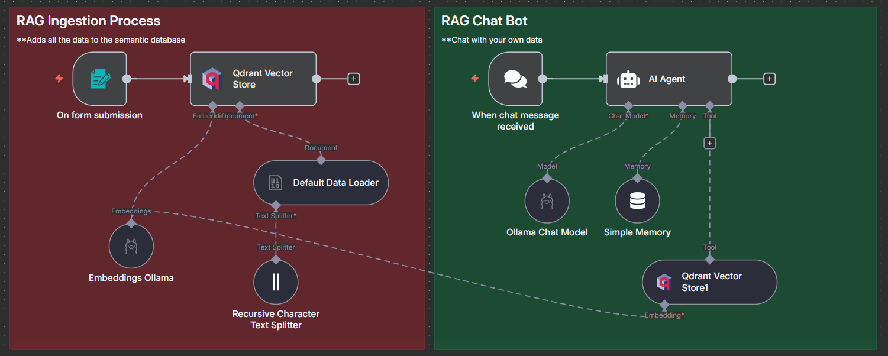

# Pizza-RAG-Chatbot
A 100% local RAG with n8n, Ollama and Qdrant. This agent uses a semantic database (Qdrant) to answer questions about PDF files.

---

## 🧩 Architecture Overview

The workflow is split into two main parts:

### **1. RAG Ingestion Process**
> Adds all your data to the semantic database

- **On Form Submission:** Accepts data input from a form.
- **Default Data Loader:** Loads the document or text data.
- **Recursive Character Text Splitter:** Breaks text into manageable chunks.
- **Embeddings Ollama:** Generates vector embeddings using your local model.
- **Qdrant Vector Store:** Stores embeddings for retrieval during chat.

### **2. RAG Chat Bot**
> Chat with your own pizza data

- **When Chat Message Received:** Listens for incoming chat prompts.
- **AI Agent:** Orchestrates context retrieval and LLM response generation.
- **Ollama Chat Model:** Local LLM `llama3.2` for chat responses.
- **Simple Memory:** Keeps context from prior messages.
- **Qdrant Vector Store:** Retrieves relevant chunks to ground LLM responses.

---

## ⚙️ Tech Stack

| Component | Purpose |
|------------|----------|
| **n8n** | Workflow orchestration |
| **LangChain** | Text loading, splitting, and chaining |
| **Ollama** | Local LLM for embeddings and responses |
| **Qdrant** | Vector database for semantic search |
| **RAG Pipeline** | Combines retrieval + generation for contextual chat |

---

## 🖼️ Workflow Preview

